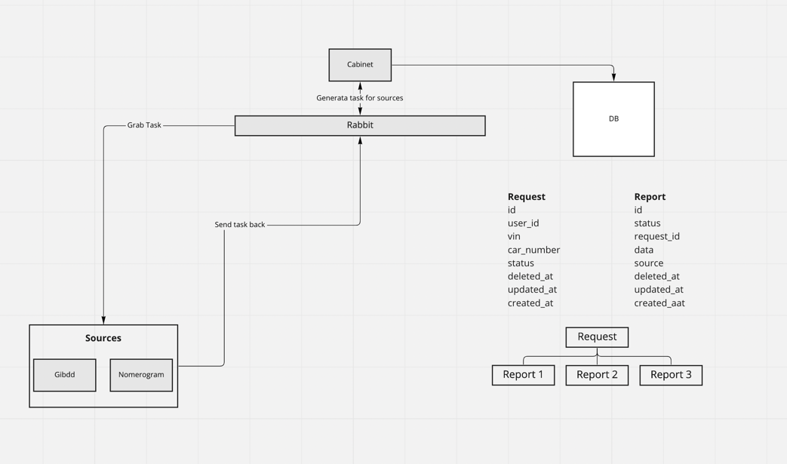

This is prototype of service, that allow you to check car VIN number to avoid any cars that was in crashes,
had credits issues, or some documents problems. You can check the similar site: https://vincheck.info/check/vin-check.php

## This prototype contains 2 services and 1 lib:
1) Vin-cabinet - service, that gives api for frontend and show car reports.
2) Vin-sources - we can use different sources for getting car information. That service serve each source, in our example
we emulate data parsing from 2 sites - gibdd (Russian automobile inspection) and nomerogram (site that gives you'r car photo by number). 
Anyway, we have all sources in one Source service, instead of having dedicated service for each source.
3) Vin-lib - composer library for transfer data between vin-cabinet and vin-sources by rabbitmq
4) DB/code entities: request - request for check you'r car, report - report from specific source (gibdd, nomerogram).
One request can have many reports, depentds on sources count.

## Architecture:

Cabinet and sources used RabbitMQ to send messages to each other.
1) Cabinet have sources list, create messages for Sources service and send it.
2) Sources receive messages and process it - parse site, process parsed pages - depends of what needed in each source case
3) After site processed, Source service send message to Cabinet. Message contains report - all information about car from this concrete Source.
   

## TODO:

Due to time limit, services needs some improvements:
1) Sources service don't parse any site - it only had data examples
2) Cabinet service needs API improvement if we want frontend integration
3) Some part of code need to be refactored
4) Need to fix some docker-compose issues to simplify running instructions
5) Need some architecture improvement to split Sources service from 1 service to 2 - Parser and Sources
6) Needs swagger API
7) Needs unit and functional test
8) Reg and auth
9) ...

## How to run

**Vin-cabinet:**
1) docker-compose up -d rabbitmq
2) Then creating queue "reports" in rabbitmq: http://localhost:15672/ guest/guest
3) docker-compose up -d
4) Run command in laravel container 
`docker exec -ti vin-cabinet-vin-cabinet-1 /bin/bash`
   `php artisan rabbitmq:consume --queue=reports `
There is some problem to run in from command section in docker-composer
5) Run php artisan db:seed inside laravel container

**Vin-sources:**
1) docker-compose up -d

## How to use
You can use a postman collection: https://www.getpostman.com/collections/3de7b83f1795a3f6a894
Or run requests manually:
1) Get all requests - GET http://localhost/api/request
2) Get specific request - GET http://localhost/api/request/145
3) Create new request - POST http://localhost/api/request

`   {
   "vin": "1FABP21B4CK165368",
   "car_number": "B738TO077"
   }`

You need to create new request, wait 2-3 secs and check that request - you will to see request + report for this request.
